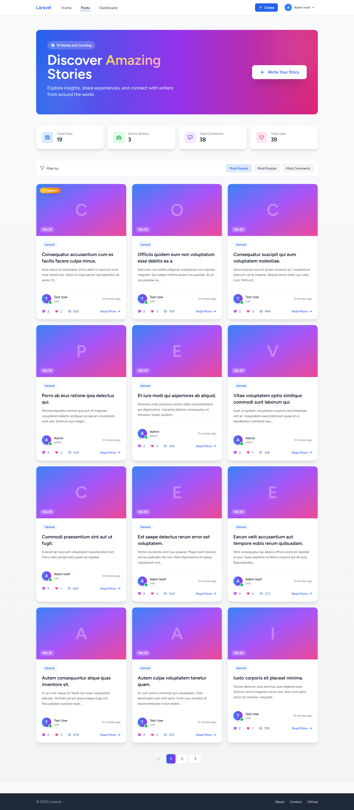
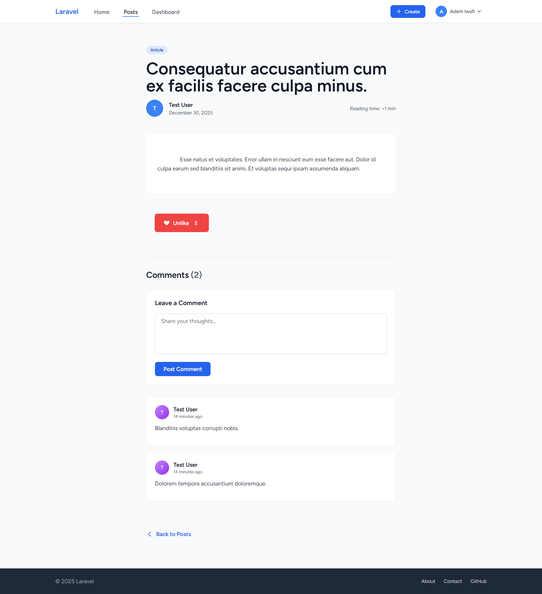
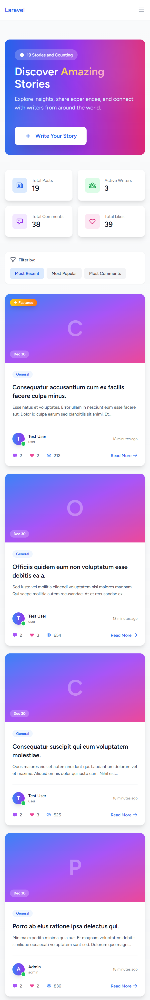

# Blog Platform

A modern, feature-rich blog platform built with Laravel, Tailwind CSS, and GSAP animations. Share your stories, engage with the community through comments, and show appreciation with likes.

## 🌟 Features

- **User Authentication** - Secure registration and login with email verification
- **Post Management** - Create, read, update, and delete blog posts
- **Comments System** - Interactive comment section with authorization controls
- **Like System** - One-click like/unlike functionality with real-time counts
- **User Roles** - Admin and regular user roles with appropriate permissions
- **Dark Mode Support** - Seamless dark/light theme switching
- **Responsive Design** - Mobile-first approach with Tailwind CSS breakpoints
- **Smooth Animations** - GSAP-powered animations for enhanced UX
- **Post Pagination** - Efficient pagination for browsing multiple posts
- **Authorization** - Role-based access control for edit/delete operations
- **Flash Messages** - User feedback for successful and error actions

## 🛠️ Tech Stack

- **Backend**: Laravel 11
- **Frontend**: Tailwind CSS, Alpine.js
- **Animations**: GSAP (GreenSock Animation Platform)
- **Database**: SQLite (default, configurable)
- **Authentication**: Laravel Breeze
- **Testing**: Pest PHP

## 📋 Requirements

- PHP 8.2+
- Composer
- Node.js 18+
- npm or yarn

## 🚀 Installation

1. **Clone the repository**
   ```bash
   git clone <repository-url>
   cd blog-platform
   ```

2. **Install PHP dependencies**
   ```bash
   composer install
   ```

3. **Install Node dependencies**
   ```bash
   npm install
   ```

4. **Create environment file**
   ```bash
   cp .env.example .env
   ```

5. **Generate application key**
   ```bash
   php artisan key:generate
   ```

## 🗄️ Database Setup

1. **Run migrations**
   ```bash
   php artisan migrate
   ```

2. **Seed the database** (optional - includes sample data)
   ```bash
   php artisan db:seed
   ```

   This will create:
   - Admin user: `admin@example.com` / `password`
   - Test user: `test@example.com` / `password`
   - 19 sample posts
   - 38 sample comments
   - 39 sample likes

3. **Fresh database reset**
   ```bash
   php artisan migrate:fresh --seed
   ```

## 📦 Running the Application

1. **Start the development server**
   ```bash
   php artisan serve
   ```

2. **Compile frontend assets** (in another terminal)
   ```bash
   npm run dev
   ```

3. **Build for production**
   ```bash
   npm run build
   ```

4. **Access the application**
   - Navigate to `http://localhost:8000`

## 📸 Screenshots

### Welcome Page

- Hero section with call-to-action
- Feature highlights
- Login/Register buttons
- Responsive hero banner

### Home Page / Posts Index

- Responsive grid layout with post cards
- Post statistics (comments, likes, views)
- "Read More" button for each post
- Featured post badge

### Post Detail Page

- Full post content display
- Author information with timestamp
- Like/Unlike button with count
- Edit/Delete buttons for authorized users
- Comments section with form

### Comments Section

- Comment form for authenticated users
- Comment list with author avatars
- Delete option for comment owners/admins
- Relative time display (e.g., "2 hours ago")

### Dark Mode

- Seamless dark theme support
- High contrast for readability
- Consistent styling across all pages

### Mobile Responsive

- Optimized for mobile devices
- Touch-friendly buttons
- Stacked layout for smaller screens

## 🎯 API Endpoints

### Public Routes
- `GET /` - Welcome page
- `GET /posts` - All posts (paginated)
- `GET /posts/{id}` - Single post detail

### Authenticated Routes
- `POST /posts` - Create new post
- `GET /posts/create` - Post creation form
- `PUT /posts/{id}` - Update post
- `DELETE /posts/{id}` - Delete post
- `GET /posts/{id}/edit` - Post edit form
- `POST /posts/{id}/like` - Toggle like
- `POST /posts/{id}/comments` - Add comment
- `DELETE /comments/{id}` - Delete comment
- `GET /profile` - User profile
- `PUT /profile` - Update profile
- `DELETE /profile` - Delete account

## 🔐 Authorization

### Post Operations
- **Create**: Authenticated users only
- **Edit/Delete**: Post owner or admin

### Comment Operations
- **Create**: Authenticated users only
- **Delete**: Comment owner or admin

### Like Operations
- **Create/Delete**: Authenticated users only

## 📁 Project Structure

```
blog-platform/
├── app/
│   ├── Http/
│   │   ├── Controllers/
│   │   │   ├── PostController.php
│   │   │   ├── CommentController.php
│   │   │   └── LikeController.php
│   │   └── Middleware/
│   └── Models/
│       ├── User.php
│       ├── Post.php
│       ├── Comment.php
│       └── Like.php
├── database/
│   ├── migrations/
│   ├── factories/
│   └── seeders/
├── resources/
│   ├── views/
│   │   ├── posts/
│   │   │   ├── index.blade.php
│   │   │   ├── show.blade.php
│   │   │   ├── create.blade.php
│   │   │   └── edit.blade.php
│   │   ├── layouts/
│   │   └── components/
│   ├── js/
│   │   └── app.js
│   └── css/
│       └── app.css
├── routes/
│   ├── web.php
│   ├── auth.php
│   └── api.php
└── tests/
    ├── Feature/
    └── Unit/
```

## 🎨 Customization

### Theme Colors
Edit `tailwind.config.js` to customize color palette:
```javascript
theme: {
  colors: {
    // Your custom colors here
  }
}
```

### GSAP Animations
Animations are configured in the blade templates. Modify animation parameters:
```javascript
gsap.to(selector, {
  duration: 0.6,
  opacity: 1,
  y: 0,
  stagger: 0.1,
});
```

### Email Configuration
Update `.env` file with your email provider:
```
MAIL_DRIVER=smtp
MAIL_HOST=your-smtp-host
MAIL_USERNAME=your-email
MAIL_PASSWORD=your-password
```

## 🧪 Testing

Run the test suite:
```bash
php artisan test
```

Run tests with coverage:
```bash
php artisan test --coverage
```

## 📝 Database Models

### User
- id, name, email, password, role, timestamps

### Post
- id, title, content, user_id, timestamps

### Comment
- id, body, post_id, user_id, timestamps

### Like
- id, post_id, user_id, timestamps

## 🚨 Troubleshooting

### Database Connection Error
- Ensure `.env` file is properly configured
- Check database file permissions (SQLite)

### Asset Compilation Issues
```bash
npm install
npm run dev
```

### Migration Failures
```bash
php artisan migrate:fresh
php artisan db:seed
```

### Permission Denied Errors
```bash
chmod -R 755 storage
chmod -R 755 bootstrap/cache
```

## 📚 Additional Resources

- [Laravel Documentation](https://laravel.com/docs)
- [Tailwind CSS Documentation](https://tailwindcss.com/docs)
- [GSAP Documentation](https://greensock.com/gsap/)
- [Alpine.js Documentation](https://alpinejs.dev/)

## 🤝 Contributing

1. Fork the repository
2. Create your feature branch (`git checkout -b feature/AmazingFeature`)
3. Commit your changes (`git commit -m 'Add some AmazingFeature'`)
4. Push to the branch (`git push origin feature/AmazingFeature`)
5. Open a Pull Request

## 📄 License

This project is open source and available under the MIT License. See the LICENSE file for details.

## 👨‍💻 Author

Created as a Portfolio Project to demonstrate modern web development practices using Laravel, Tailwind CSS, and contemporary frontend technologies.

---

**Happy Blogging! 🎉**
