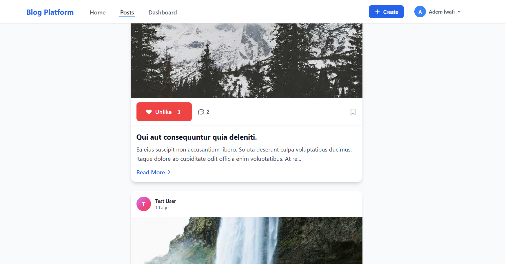

# Blog Platform

Modern, animated blog platform powered by Laravel 11, Tailwind CSS, GSAP, and React islands. Posts, comments, likes, roles, dark mode, and a React-driven infinite feed all live together.

## 🌟 Features

- **React islands**: Like buttons, comments, filters, and infinite scrolling feed mounted via `data-component` hooks
- **Animated UX**: GSAP hero, stat counters, scroll progress, parallax cards, and smooth entrances
- **Post & media**: CRUD with optional images, rich excerpts, and quick author context
- **Engagement**: Comments with auth guard, like/unlike, and live counts
- **Infinite scroll feed**: React-powered `/api/posts/feed` with Intersection Observer loading
- **Roles & auth**: Admin vs. user permissions, email/password auth (Breeze)
- **Theming**: Dark/light support, glassmorphism touches, responsive layouts
- **DX niceties**: Flash messages, friendly seed data, and Vite build pipeline

## 🛠️ Tech Stack

- **Backend**: Laravel 11
- **Frontend**: Blade + Tailwind CSS + React islands (Vite)
- **Animations**: GSAP + ScrollTrigger
- **Database**: SQLite by default (env-configurable)
- **Authentication**: Laravel Breeze
- **Testing**: Pest PHP

## 📋 Requirements

- PHP 8.2+
- Composer
- Node.js 18+
- npm or yarn

## 🚀 Installation

1) Clone and enter the project
```bash
git clone <repository-url>
cd blog-platform
```

2) Install dependencies
```bash
composer install
npm install
```

3) Environment and key
```bash
cp .env.example .env
php artisan key:generate
```

## 🗄️ Database Setup

1) Migrate
```bash
php artisan migrate
```

2) Seed (optional but recommended for demo data)
```bash
php artisan db:seed
```
- Admin user: `admin@example.com` / `password`
- Test user: `test@example.com` / `password`
- Posts: 3 per existing user
- Comments: 2 per post
- Likes: 1–5 random users per post

3) Reset with fresh seed
```bash
php artisan migrate:fresh --seed
```

## 📦 Running the Application

1) Backend
```bash
php artisan serve
```

2) Frontend
```bash
npm run dev
```

3) Production build
```bash
npm run build
```

4) Open `http://localhost:8000`

## 📸 Screenshots

New screenshots coming. Drop your captures into `./screenshots/` and replace the placeholders below.

- Welcome / hero
	
- Posts feed (infinite scroll + likes)
	
- Post detail with comments
	
- Dark mode
	
- Mobile view
	

## 🎯 API / UI Touchpoints

- `GET /` welcome with GSAP hero + stat counters
- `GET /posts` posts index with React infinite scroll feed
- `GET /posts/{id}` post detail with React comments and like button
- `POST /posts/{id}/like` toggle like (guarded)
- `POST /posts/{id}/comments` add comment (guarded)
- `GET /api/posts/feed` JSON feed used by React infinite scroll

## 🔐 Authorization

- Posts: create (auth), edit/delete (owner or admin)
- Comments: create (auth), delete (owner or admin)
- Likes: toggle (auth)

## 🧩 React Islands

- Components live in `resources/js/components` and mount via `data-component="ComponentName"` attributes in Blade.
- Mount helper: `resources/js/utils/mountComponents.js` (wired in `react-app.jsx`).
- Examples: `LikeButton`, `Comments`, `PostFilters`, `InfiniteScrollPosts`.

## 🎨 Customization

- **Tailwind**: tweak design tokens in `tailwind.config.js`.
- **GSAP**: hero/stats/scroll animations in `resources/views/welcome.blade.php`.
- **React feed**: infinite scroll logic in `resources/js/components/InfiniteScrollPosts.jsx`.

## 🧪 Testing

```bash
php artisan test
```

## 🚨 Troubleshooting

- Clear caches after config/name changes: `php artisan config:clear && php artisan cache:clear && php artisan view:clear`
- Asset issues: `npm install && npm run dev`
- DB issues: verify `.env` and rerun `php artisan migrate:fresh --seed`

## 📚 Useful Links

- [Laravel Docs](https://laravel.com/docs)
- [Tailwind CSS](https://tailwindcss.com/docs)
- [GSAP](https://greensock.com/gsap/)

---

Happy blogging! 🎉
